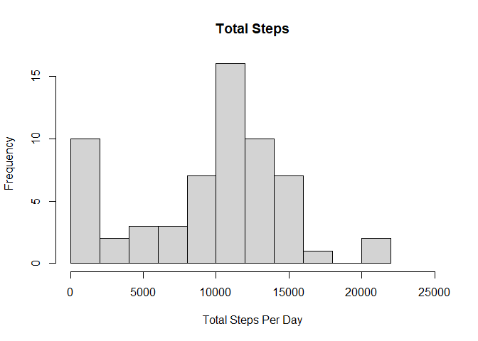
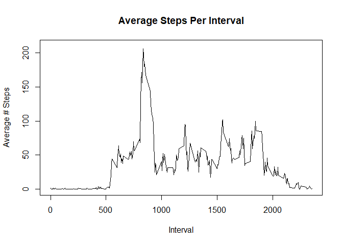
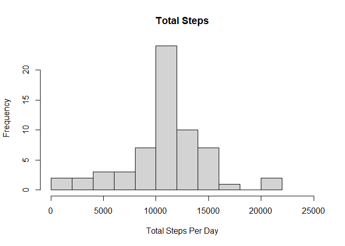
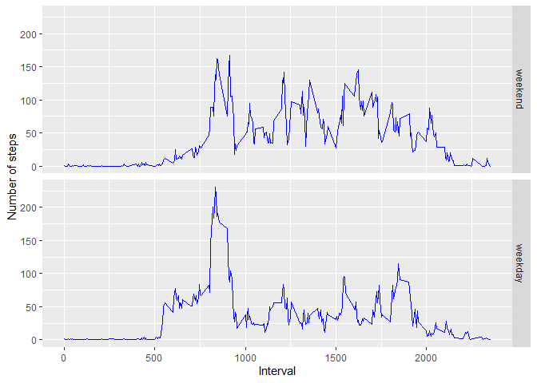

## Loading and preprocessing the data  

Read the data from the activity zipfile and convert the character data to date format  


```r
library(dplyr)
```

```
## 
## Attaching package: 'dplyr'
```

```
## The following objects are masked from 'package:stats':
## 
##     filter, lag
```

```
## The following objects are masked from 'package:base':
## 
##     intersect, setdiff, setequal, union
```

```r
library(ggplot2)
act<-read.csv(unz("activity.zip","activity.csv"))

act$date<-as.Date(act$date, "%Y-%m-%d")
```

## What is mean total number of steps taken per day?  

Group the data by day and calculate the total number of steps for each day and store in new dataframe - actbyday    


```r
actbyday<-act%>%group_by(date)%>%summarize(totsteps=sum(steps,na.rm=TRUE))

meansteps<-round(mean(actbyday$totsteps))
mediansteps<-round(median(actbyday$totsteps))
```
The mean number of steps per day is 9354 steps.  
The median number of steps per day is 10395 steps. 

The below histogram shows the frequency of different total number of steps per day:  

```r
with(actbyday,hist(totsteps,main="Total Steps",xlab="Total Steps Per Day",ylab="Frequency",freq=TRUE,breaks=10,xlim=c(0,25000)))
```

<!-- -->


## What is the average daily activity pattern?  

Group the data by time interval and calculate the average number of steps for each and store in new dataframe - actintavg  

```r
actintavg<-act%>%group_by(interval)%>%summarize(avgsteps=mean(steps,na.rm=TRUE))

maxind<-which.max(actintavg$avgsteps)
maxint<-actintavg[[1]][maxind]
```
The time interval with the most number of steps is: 835.  

The time series plot for average steps per interval is:  

```r
with(actintavg,plot(interval,avgsteps,main="Average Steps Per Interval",xlab="Interval",ylab="Average # Steps",type="l",ylim=c(0,210)))
```

<!-- -->


## Imputing missing values  

```r
totmissing<-sum(is.na(act$steps))
```
The total number of records with missing values for steps is 2304.  

Use the average number of steps per interval to impute values for missing values and store in new dataframe - actimp  

```r
actimp<-act%>%left_join(actintavg,by="interval")%>%mutate(steps=ifelse(is.na(steps),avgsteps,steps))%>%select(-avgsteps)

actimpbyday<-actimp%>%group_by(date)%>%summarize(totsteps=sum(steps))

meanimpsteps<-round(mean(actimpbyday$totsteps))
medianimpsteps<-round(median(actimpbyday$totsteps))
```

The mean number of steps per day with imputed data is 10766 steps.  
The median number of steps per day with imputed data is 10766 steps. 

The below histogram shows the frequency of different total number of steps per day including imputed data:  

```r
with(actimpbyday,hist(totsteps,main="Total Steps",xlab="Total Steps Per Day",ylab="Frequency",freq=TRUE,breaks=10,xlim=c(0,25000)))
```

<!-- -->

The difference between the analysis with no imputed data and that with imputed data includes:  
- Mean steps per day difference between imputed data and non-imputed data is: 1412 steps.   
- Median steps per day difference between imputed data and non-imputed data is: 371 steps.   

Conclusion: Imputing steps for missing values increased the mean and median per day values.   

## Are there differences in activity patterns between weekdays and weekends?

Add a factor to the imputed dataframe indicating whether the day in question was a weekday or weekend.  

```r
weekdays1 <- c('Monday', 'Tuesday', 'Wednesday', 'Thursday', 'Friday')
actimp$daytype<-factor((weekdays(actimp$date) %in% weekdays1),levels=c(FALSE, TRUE), labels=c('weekend','weekday'))
actintavgimpbydatetype<-actimp%>%group_by(interval,daytype)%>%summarize(avgsteps=mean(steps),.groups="drop")
```
Panel plot of average steps taken, by weekday or weekend, by interval:  

```r
g<-ggplot(actintavgimpbydatetype,aes(interval,avgsteps))
g<-g+geom_line(col="blue")+facet_grid(daytype~.)+labs(x="Interval",y="Number of steps")
print(g)
```

<!-- -->

Based on these plots we can see that there is more activity later in the day on weekends. 
Conversely there is more activity earlier in the day on weekdays.
